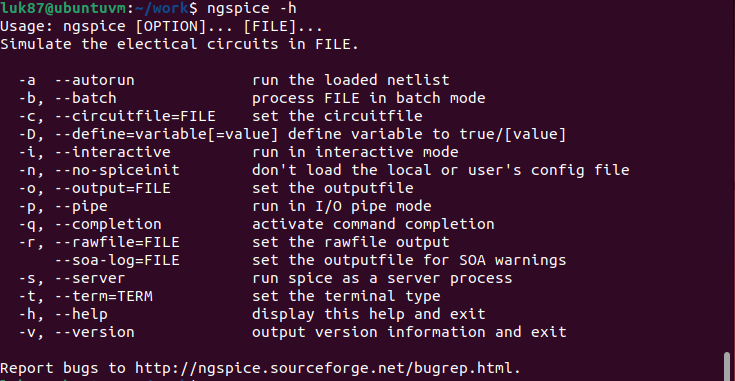

# VSDHDP
VSDHDP

# Day 0
Checking yosys


Checking ngspice



Checking sta


Checking iverilog


Checking gtkwave


# Day 1 - Introduction to Verilog RTL design and Synthesis

Run iverilog and gtkwave on good_mux.v


Run yosys
```
yosys> read_liberty -lib ../lib/sky130_fd_sc_hd__tt_025C_1v80.lib
```


Read verilog file and run synth
```
yosys> read_verilog good_mux.v
yosys> synth -top good_mux
```


Run abc - generate the gate netlist

```
yosys> abc -liberty ../lib/sky130_fd_sc_hd__tt_025C_1v80.lib
yosys> show
```
Loos like libs contain cell mux


