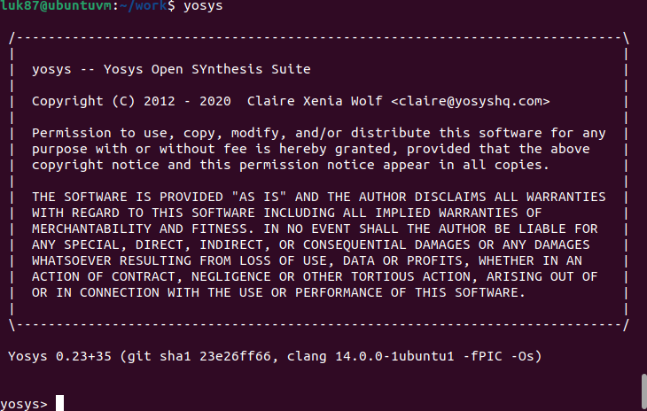
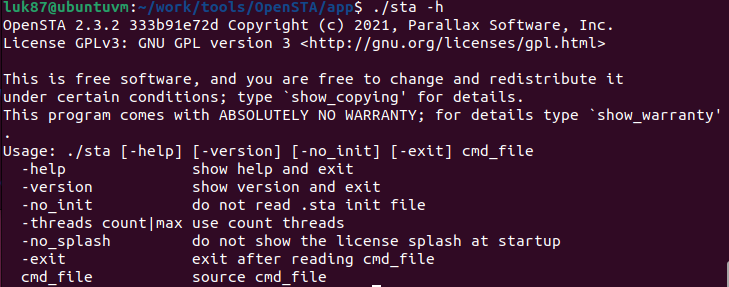

# VSDHDP
VSDHDP

# Day 0
Checking yosys

Checking ngspice

Checking sta

Checking iverilog

Checking gtkwave

# Day 1 - Introduction to Verilog RTL design and Synthesis

Run iverilog and gtkwave on good_mux.v
